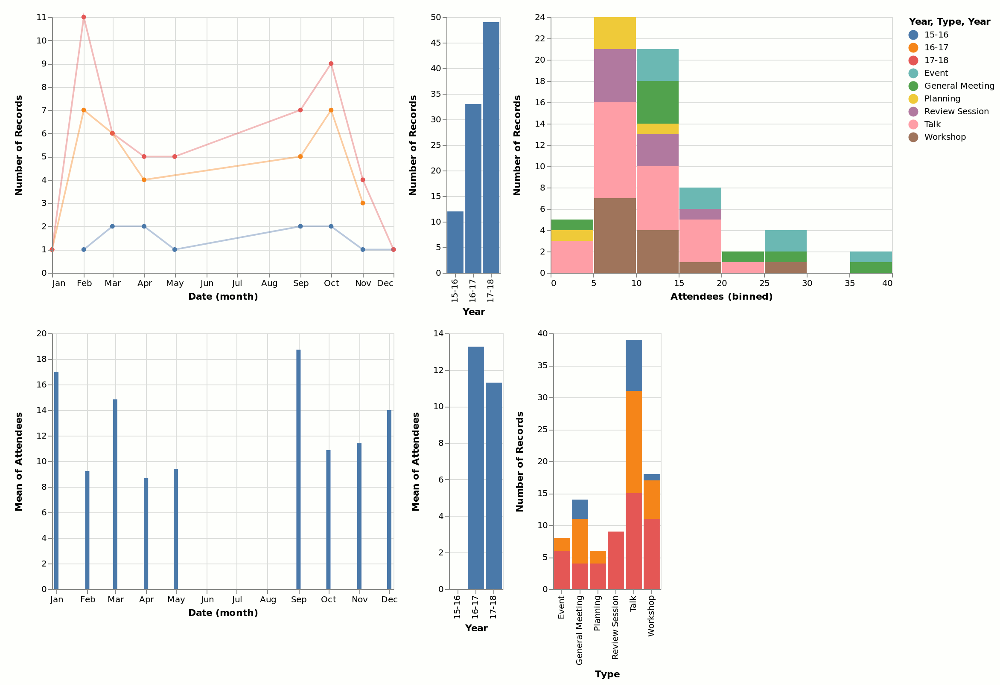

# CSA Data Visualization [](https://travis-ci.org/ExcaliburZero/csa-data-visualization-altair) [](https://coveralls.io/github/ExcaliburZero/csa-data-visualization-altair?branch=master)
This is a program that hosts a webpage with visualizations of SUNY Oswego's Computer Science Association meeting dataset.



## Usage
To generate the html webpage with the data visualizations, run the following commands.

```
# Grab the dataset
$ make download_data

# Generate the plot page
$ make build
```
